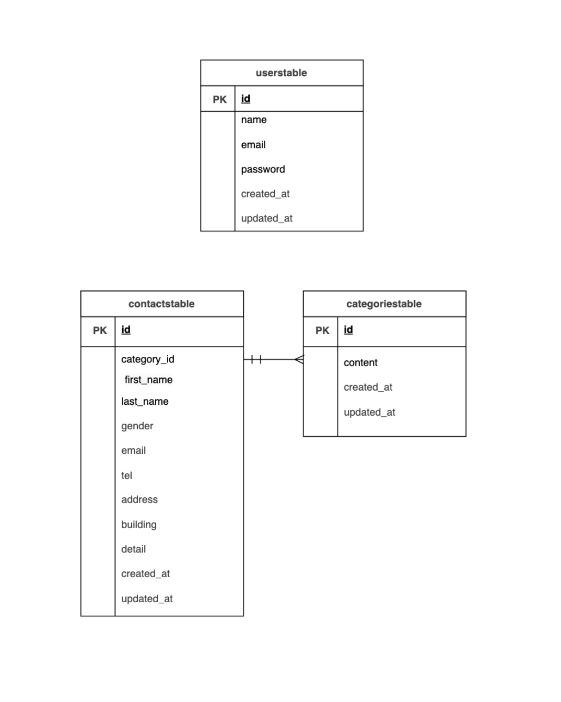

# confirmationtest

## 環境構築
 Dockerのビルド
  1.	git clone git@github.com:ChihiroKuno/confirmationtest.git
  2.	docker-compose up -d --build

※ MySQLは、OSによって動かない場合があるのでそれぞれのPCに合わせて docker-compose.yml ファイルを編集してください。

Laravel環境構築手順

	1.	docker-compose exec php bash
	2.	composer install
	3.	.env.example ファイルをコピーし .env を作成し、環境設定を編集 cp .env.example .env
	4.	php artisan key:generate
	5.	php artisan migrate
	6.	php artisan db:seed

## 使用技術(実行環境)
  
  •	PHP 7.4.9
	•	Laravel 8.83.29
	•	MySQL 8.0.26
	•	Laravel Fortify（認証機能）
	•	Docker / Docker Compose

## ER図

## URL

　	•開発環境： http://localhost/
　	•phpMyAdmin： http://localhost:8080/
